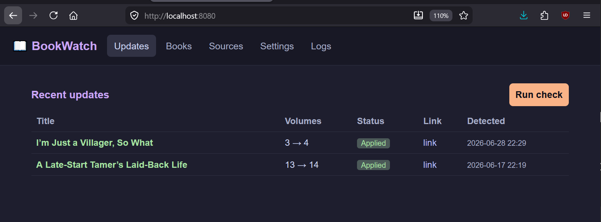
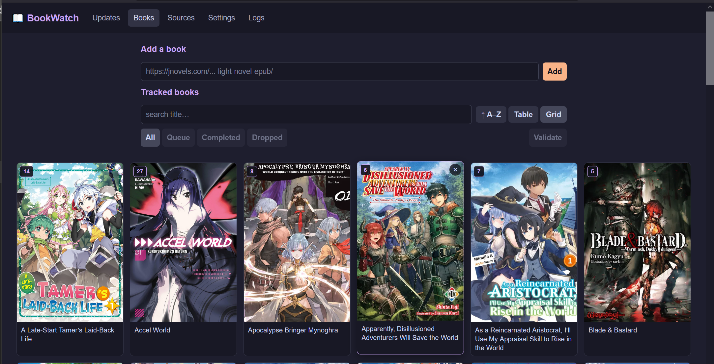
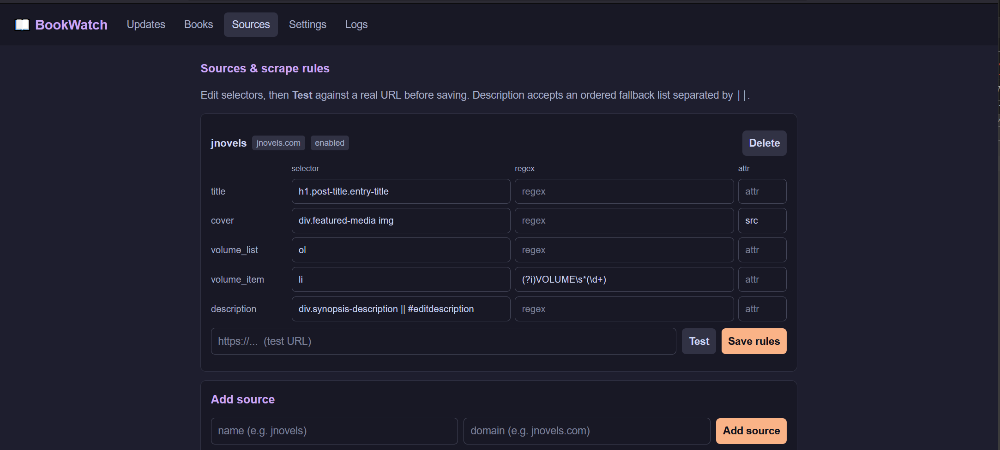
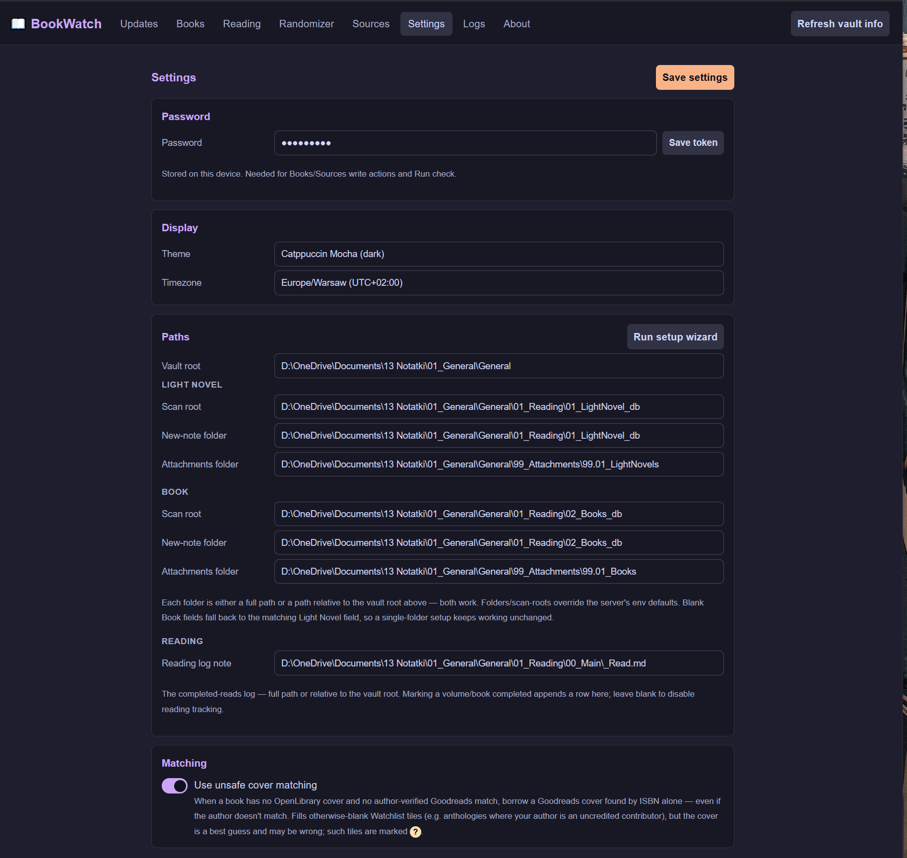

# BookWatch

BookWatch watches light-novel series for new volumes and keeps your Obsidian
notes in sync. It scrapes each series' source page, detects when a new volume
has dropped, and — on your say-so — writes the bump back into the matching vault
note. A single Go binary serves the web UI, the HTTP API, and a built-in
scheduler; everything is stored in a local SQLite file.

> **Status:** v1.0.0 — light novels, working well in daily use. v1.1.0 is
> planned to generalise tracking beyond light novels to books in general
> (author release tracking).

## Features

- **New-volume detection** — scrapes each tracked series and compares the latest
  volume count against what's recorded.
- **Obsidian integration** — discovers notes by the `#LightNovel` tag (folder-
  agnostic), reads their frontmatter, and writes updates back atomically without
  disturbing the rest of the note.
- **Detect first, apply on demand** — checks never touch the vault. Detected
  bumps are queued as *pending*; one click (**Update Obsidian**) writes them all,
  stamping `Volumes:` and `Last Update:`.
- **Scheduled checks** — a cron expression runs checks automatically (default:
  daily at 09:00).
- **Configurable sources** — per-domain scrape rules (CSS selectors + regex for
  the volume list, title, cover, description) editable in the UI, with a **Test**
  button that shows what a rule set would extract before you save it.
- **Status auto-correction** — nudges a note's `Status` between `Queue` and
  `Completed` based on new volumes vs. your read progress (never touches
  `Dropped`).
- **Anomaly guard** — a scrape that succeeds but reads fewer volumes than
  recorded is flagged as *suspicious* and logged instead of silently masquerading
  as "no update", so a broken selector can't corrupt your data.
- **Self-healing tracking** — books are upserted from the scan and stale rows
  (note moved, retagged, or deleted) are auto-pruned.
- **Activity log** — adds, untracks, applies, status fixes, prunes, and anomalies
  are all recorded and viewable in the UI.

## Web UI

The server embeds a single-page UI with five tabs:

| Tab | What it does |
|-----|--------------|
| **Updates** | Pending new-volume bumps; **Update Obsidian** applies them all. |
| **Books** | Everything tracked, with search, status filters, and sorting. |
| **Sources** | Manage source sites and their scrape rules; test rules live. |
| **Settings** | Vault/scan paths and the device-local write password. |
| **Logs** | Activity and past check runs. |

## Screenshots

**Updates** — pending new-volume bumps, applied to the vault on demand.



**Books** — everything tracked, with search, status filters, and a cover grid.



**Sources & rules** — per-domain scrape rules with a live Test button.



**Settings** — vault paths and the device-local write password.



## How a note is recognised

A note is tracked when its YAML frontmatter has **both**:

- the `#LightNovel` tag, and
- `Template_used: LightNovelTemplate`, and
- a `Link:` to the source page.

Fields BookWatch reads (and, on apply, writes):

```yaml
---
tags: [LightNovel]
Template_used: LightNovelTemplate
Link: https://example.com/series/some-novel
Volumes: 12          # written on apply
Last Update: 2026-06-29   # written on apply
Cover: "[[some-novel.jpg]]"
Status:
  - Queue            # may be auto-corrected (Queue ⇄ Completed)
Read Volumes: 9      # used for status correction; never overwritten
---
```

Updates are written line-by-line via a temp-file-and-rename, so a crash mid-write
can't leave a half-written note, and untouched lines (and your newline style) are
preserved.

## Getting started

### Requirements

- Go 1.26+
- An Obsidian vault with notes using the `LightNovelTemplate` frontmatter above

### Configuration

BookWatch reads its settings from environment variables. For local use, copy
[`.env.example`](.env.example) to `.env` (gitignored) and fill it in — the app
auto-loads it at startup, and real environment variables always override it.

| Variable | Default | Purpose |
|----------|---------|---------|
| `BOOKWATCH_PASSWORD` | *(required for serve)* | Shared password for write endpoints. |
| `BOOKWATCH_VAULT_DIR` | `./vault` | Absolute path to your vault root. |
| `BOOKWATCH_SCAN_ROOT` | `<vault>/LightNovel` | Folder scanned for tagged notes. |
| `BOOKWATCH_NEW_NOTE_DIR` | `LightNovel` | Where `add` creates new notes (vault-relative). |
| `BOOKWATCH_ATTACHMENTS_DIR` | `LightNovel/_attachments` | Cover location (vault-relative). |
| `BOOKWATCH_DB_PATH` | `bookwatch.db` | SQLite database file. |
| `BOOKWATCH_PORT` | `8080` | HTTP listen port. |
| `BOOKWATCH_CHECK_CRON` | `0 9 * * *` | Cron expression for scheduled checks. |
| `BOOKWATCH_USER_AGENT` | `Mozilla/5.0 (page-watcher/1.0)` | Scraper user agent. |
| `BOOKWATCH_TIMEOUT` | `30` | Per-request timeout, seconds. |

### Run the server

```sh
go run ./cmd/bookwatch serve
# or build a binary:
go build -o bookwatch ./cmd/bookwatch && ./bookwatch serve
```

Then open <http://localhost:8080>. Set the password in **Settings** (stored on
the device) to unlock write actions and the **Run check** button.

## Command line

```
bookwatch serve                              run the HTTP server + scheduler
bookwatch check [-root DIR] [-quiet] [-record] [-write]
                                             scan and report new volumes
bookwatch add URL [-vault DIR] [-dir REL] [-attach REL]
                                             create a tracked note from a URL
```

- `check` is read-only by default. `-record` persists the run to the DB;
  `-write` applies bumps to the vault. With no subcommand, `check` is the default.

## Security model

- **Reads are open; writes require the password.** Every write endpoint checks an
  `X-BookWatch-Token` header (constant-time compare); the password is never
  accepted as a query parameter, so it can't leak into logs or history.
- Request bodies are capped, and responses carry a strict
  Content-Security-Policy plus `nosniff` / `no-referrer`.
- Intended for `localhost` / trusted-LAN use. Put it behind a reverse proxy with
  TLS if you expose it more widely.

## Project layout

```
cmd/bookwatch        entry point (serve / check / add)
internal/config      env + .env configuration
internal/vault       Obsidian note scan + atomic frontmatter writes
internal/scraper     HTTP fetch + goquery rule engine
internal/sources     URL → scrape-rules resolution (per domain)
internal/checker     concurrent volume checks
internal/service     orchestration: scan → check → apply → record
internal/store       SQLite persistence (books, updates, runs, events, sources)
internal/scheduler   cron-driven checks + run state
internal/server      HTTP API + embedded web UI
```

Built with [goquery](https://github.com/PuerkitoBio/goquery),
[robfig/cron](https://github.com/robfig/cron), and the pure-Go
[modernc.org/sqlite](https://pkg.go.dev/modernc.org/sqlite) driver (no cgo).

## Tests

```sh
go test ./...
```

## License

Released under the [MIT License](LICENSE).
