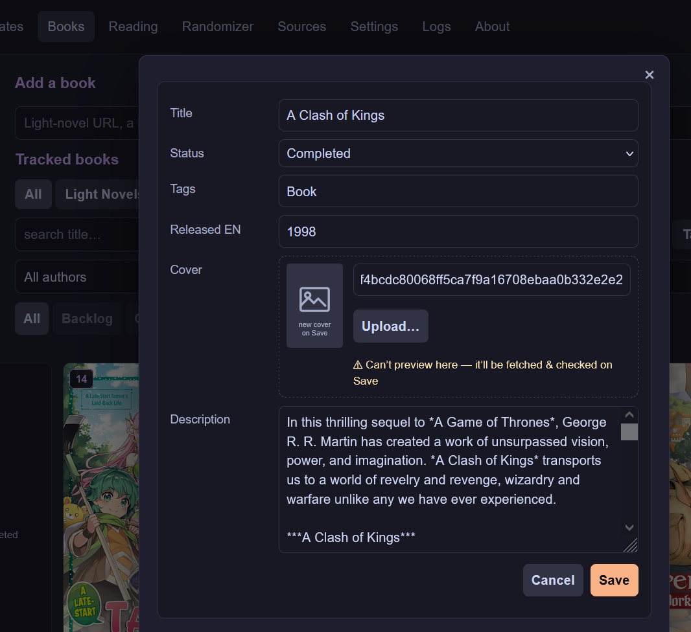
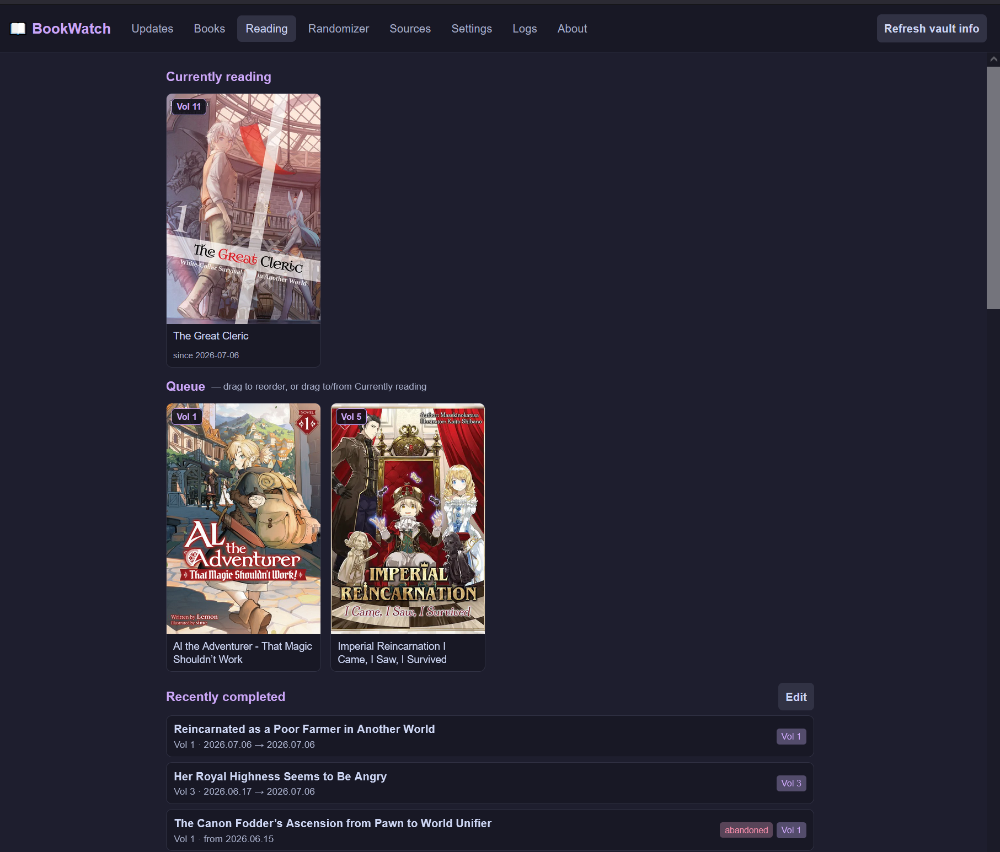
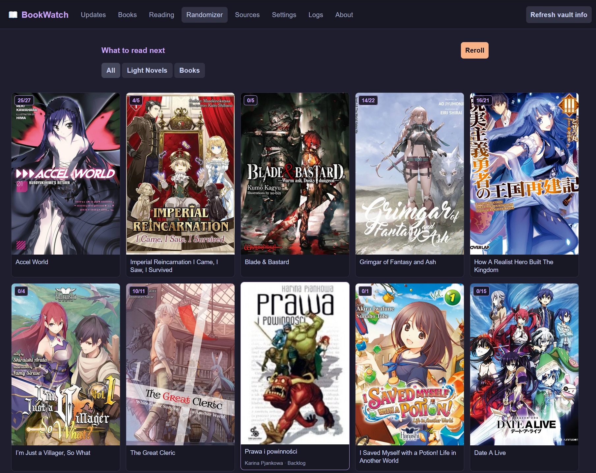
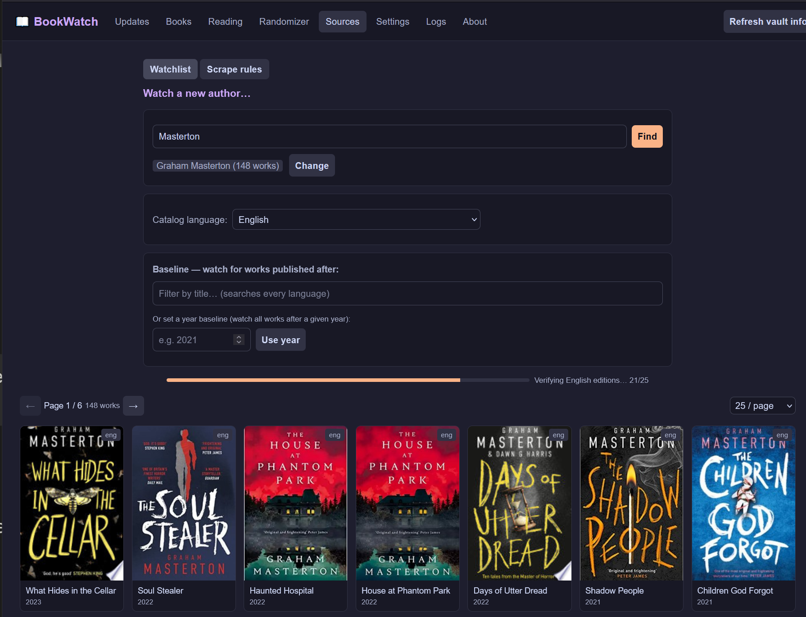

# BookWatch

BookWatch watches your reading list — light-novel series *and* regular books —
for new releases and keeps your Obsidian vault in sync. It scrapes source
pages and author catalogs, detects new volumes or new books, and — on your
say-so — writes the update back into the matching vault note. A single Go
binary serves the web UI, the HTTP API, and a built-in scheduler; everything
is stored in a local SQLite file.

> **Status:** v1.2.0 — everything from v1.1.0 (light-novel volume tracking,
> book tracking, author watchlists, a reading queue/log, and a randomizer) plus
> a Calibre library importer, per-volume light-novel notes, a jnovels fallback
> for adding light novels, a Discover tab, and an in-app update check. Series
> tracking and full dual-language (EN+PL) trackers are deferred to a later
> release.

## Features

- **New-volume & new-book detection** — scrapes each tracked light-novel
  series and polls watched authors (via OpenLibrary, with an optional
  Lubimyczytać pass for Polish translations) for releases past your baseline.
- **Obsidian integration** — discovers notes by the `#LightNovel` or `#Book`
  tag (folder-agnostic), reads their frontmatter, and writes updates back
  atomically without disturbing the rest of the note.
- **Detect first, apply on demand** — checks never touch the vault. Detected
  bumps and new releases are queued as *pending*; one click (**Update
  Obsidian**) writes them all.
- **Author watchlist** — search OpenLibrary for an author, pick a catalog
  language and a baseline (a cutoff work or a bare year), and BookWatch polls
  for anything newer. Optionally also watches for a Polish translation of a
  tracked book, since those often lag the original by a year or more.
- **Reading tab** — a currently-reading slot plus a drag-to-reorder queue,
  backed entirely by SQLite (no vault writes just for queue order). Marking a
  book or light-novel volume complete appends a row to a single, vault-wide
  completed-reads log and — for light novels — auto-corrects `Status` and
  auto-queues the next volume. Completing (or editing a completed entry) can also
  save personal notes into a `## Notes` section of the note — the per-volume note
  for a light novel, or the book's own note.
- **Randomizer** — reroll a handful of random Backlog picks, filterable by
  light novels or books, to decide what to read next.
- **Calibre import** — point BookWatch at a Calibre library, and it reads the
  `metadata.db` (read-only), matches each entry against your vault, and stages
  new `#Book`/`#LightNovel` notes. A resumable, in-app reviewer lets you accept,
  reject, or fix each match — with an OpenLibrary cover picker and description
  pull — before anything is written to the vault.
- **jnovels light-novel support** — when adding a book, a jnovels title-search
  fallback finds the series, and per-volume `#LNVolume` notes are backfilled
  from the series page. A **Discover** tab surfaces jnovels' latest releases and
  a spoiler-safe find-new pass for series you already track.
- **Per-volume notes** — each light-novel volume gets its own note with its own
  `Status`; completing a volume writes to both the volume note and the series
  note, and can save personal notes into the volume's completed entry.
- **In-app update check** — the About tab compares your build against the latest
  GitHub release and tells you when a newer version is out (notify-only; it
  never downloads or installs anything).
- **Scheduled checks** — a cron expression runs checks automatically (default:
  daily at 09:00).
- **Configurable sources** — per-domain scrape rules (CSS selectors + regex for
  the volume list, title, cover, description) editable in the UI, with a
  **Test** button that shows what a rule set would extract before you save it.
- **Status auto-correction** — nudges a note's `Status` between `Backlog` and
  `Completed` based on new volumes vs. your read progress (never touches
  `Dropped`, and never flips a completed book back just because a scrape
  changed the volume count).
- **Anomaly guard** — a scrape that succeeds but reads fewer volumes than
  recorded is flagged as *suspicious* and logged instead of silently
  masquerading as "no update", so a broken selector can't corrupt your data.
- **Self-healing tracking** — books are upserted from the vault scan and stale
  rows (note moved, retagged, or deleted) are auto-pruned; a **Refresh vault
  info** button reconciles the DB against the vault without touching sources.
- **Guided setup wizard** — a numbered-step wizard picks your vault root,
  fills in sensible sub-paths, creates any missing folders, and writes an
  empty reading log — no manual `.env` editing required to get started.
- **Activity log** — adds, untracks, applies, status fixes, prunes, and
  anomalies are all recorded and viewable in the UI.

## Web UI

The server embeds a single-page UI with real per-tab URLs (browser back/
forward and deep links both work):

| Tab | What it does |
|-----|--------------|
| **Updates** | Pending new-volume/new-book bumps; **Update Obsidian** applies them. |
| **Books** | Everything tracked (light novels + books), with search, status filters, and sorting. |
| **Reading** | Currently reading, a reorderable queue, and the completed-reads log. |
| **Randomizer** | Random Backlog picks to decide what to read next. |
| **Discover** | Browse jnovels' latest light novels and a spoiler-safe find-new pass, add straight to your library. |
| **Sources** | Author watchlist (OpenLibrary/Lubimyczytać) and per-domain scrape rules, testable live. |
| **Import** | Import a Calibre library — stage notes from `metadata.db` and review each match before it's written. |
| **Settings** | Vault/scan paths (light novels and books can point at different folders), reading log path, the device-local write password, and the setup wizard. |
| **Logs** | Activity and past check runs. |
| **About** | Version, repo, license, issue-tracker links, and a check-for-updates button. |

## Screenshots

**Books** — everything tracked, with search, status filters, and a cover grid.


**Editing a book** — full frontmatter fields, with cover upload/fetch.



**Reading** — currently reading, a drag-to-reorder queue, and recent completions.



**Randomizer** — a handful of random Backlog picks, filterable by kind.



**Sources — watchlist** — watch an author, set a catalog language and baseline.



**Updates** — pending new-volume/new-book bumps, applied to the vault on demand.


**Settings** — separate Light Novel/Book paths, reading log, and the setup wizard.


## How a note is recognised

A **light-novel** note is tracked when its YAML frontmatter has:

- the `#LightNovel` tag, `Template_used: LightNovelTemplate`, and a `Link:` to
  the source page.

```yaml
---
tags: [LightNovel]
Template_used: LightNovelTemplate
Link: https://example.com/series/some-novel
Volumes: 12          # written on apply
Last Update: 2026-06-29   # written on apply
Cover: "[[some-novel.jpg]]"
Status:
  - Backlog          # auto-corrected between Backlog/Completed
Read Volumes: 9      # single source of truth for progress; synced on completion
---
```

A **book** note is tracked when its frontmatter has the `#Book` tag and
`Template_used: BookTemplate`. Books are single works (no volume count) —
`Status` flips straight to `Completed` when you mark it read:

```yaml
---
tags: [Book]
Template_used: BookTemplate
Title: A Clash of Kings
Author: George R. R. Martin
Link: https://openlibrary.org/works/OL...
Work ID: OL...W
Released EN: 1998
Cover: "[[clash-of-kings.jpg]]"
Status:
  - Backlog
---
```

Updates are written line-by-line via a temp-file-and-rename, so a crash mid-write
can't leave a half-written note, and untouched lines (and your newline style) are
preserved.

## Getting started

### Requirements

- Go 1.26+
- An Obsidian vault with notes using the `LightNovelTemplate` and/or
  `BookTemplate` frontmatter above

### Configuration

BookWatch reads its settings from environment variables. For local use, copy
[`.env.example`](.env.example) to `.env` (gitignored) and fill it in — the app
auto-loads it at startup, and real environment variables always override it.
Most of these can also be set from the **Settings** tab (or the setup wizard)
after first run.

| Variable | Default | Purpose |
|----------|---------|---------|
| `BOOKWATCH_PASSWORD` | *(required for serve)* | Shared password for write endpoints. |
| `BOOKWATCH_VAULT_DIR` | `./vault` | Absolute path to your vault root. |
| `BOOKWATCH_SCAN_ROOT` | `<vault>/LightNovel` | Folder scanned for `#LightNovel` notes. |
| `BOOKWATCH_NEW_NOTE_DIR` | `LightNovel` | Where `add` creates new LN notes (vault-relative). |
| `BOOKWATCH_ATTACHMENTS_DIR` | `LightNovel/_attachments` | LN cover location (vault-relative). |
| `BOOKWATCH_BOOK_SCAN_ROOT` | *(falls back to `SCAN_ROOT`)* | Folder scanned for `#Book` notes. |
| `BOOKWATCH_BOOK_NEW_NOTE_DIR` | *(falls back to `NEW_NOTE_DIR`)* | Where new `#Book` notes are created. |
| `BOOKWATCH_BOOK_ATTACHMENTS_DIR` | *(falls back to `ATTACHMENTS_DIR`)* | Book cover location. |
| `BOOKWATCH_READING_LOG_PATH` | *(disabled)* | Path to the unified completed-reads log; usually set via Settings/the wizard. |
| `BOOKWATCH_DB_PATH` | `config/bookwatch.db` (next to the exe) | SQLite database file. A legacy root-level `bookwatch.db` is auto-migrated into `config/` on first startup. |
| `BOOKWATCH_PORT` | `8080` | HTTP listen port. |
| `BOOKWATCH_CHECK_CRON` | `0 9 * * *` | Cron expression for the scheduled LN volume check. Editable in Settings (`ln_check_cron`), takes effect without restart. |
| `BOOKWATCH_TRACKER_CRON` | `0 10 * * *` | Cron expression for the scheduled author/release tracker poll — runs on its own schedule, independent of the LN check (#80). Editable in Settings (`tracker_check_cron`), takes effect without restart. |
| `BOOKWATCH_GB_KEY` | *(none)* | Google Books API key, used as a cover fallback. |
| `BOOKWATCH_USER_AGENT` | `Mozilla/5.0 (page-watcher/1.0)` | Scraper user agent. |
| `BOOKWATCH_TIMEOUT` | `30` | Per-request timeout, seconds. |

Blank Book path settings fall back to the matching Light Novel setting, so a
single-folder setup keeps working unchanged.

### Run the server

```sh
go run ./cmd/bookwatch serve
# or build a binary:
go build -o bookwatch ./cmd/bookwatch && ./bookwatch serve
# or a release build with the version stamped (shown in the About tab + /api/version):
go build -ldflags "-X bookwatch/internal/buildinfo.Version=v1.2.0" -o bookwatch ./cmd/bookwatch
```

Then open <http://localhost:8080>. On first run with no vault configured, the
setup wizard walks you through picking a vault and folders. Set the password
in **Settings** (stored on the device) to unlock write actions and the **Run
check** button.

## Command line

```
bookwatch serve                              run the HTTP server + scheduler
bookwatch check [-root DIR] [-quiet] [-record] [-write]
                                             scan and report new volumes
bookwatch add URL [-vault DIR] [-dir REL] [-attach REL]
                                             create a tracked LN note from a URL
```

- `check` is read-only by default (and the default subcommand when none is
  given). `-record` persists the run to the DB; `-write` applies bumps to the
  vault.

## Security model

- **Reads are open; writes require the password.** Every write endpoint checks an
  `X-BookWatch-Token` header (constant-time compare); the password is never
  accepted as a query parameter, so it can't leak into logs or history.
- Request bodies are capped (1 MiB for JSON writes, 16 MiB for cover uploads),
  and responses carry a strict Content-Security-Policy plus `nosniff` /
  `no-referrer`.
- Cover downloads go through an SSRF-guarded HTTP client and reject
  non-image responses.
- Intended for `localhost` / trusted-LAN use. Put it behind a reverse proxy with
  TLS if you expose it more widely.

## Project layout

```
cmd/bookwatch        entry point (serve / check / add)
internal/config      env + .env configuration
internal/vault       Obsidian note scan + atomic frontmatter writes
internal/notes       frontmatter builders for LightNovel and Book notes
internal/calibre     read-only Calibre metadata.db reader
internal/importer    Calibre import staging, matching, review, and finalize
internal/reading     completed-reads log parser, re-read counter, appender
internal/scraper     HTTP fetch + goquery rule engine
internal/sources     URL → scrape-rules resolution (per domain)
internal/provider    OpenLibrary / Google Books / Goodreads / Lubimyczytać clients
internal/checker     concurrent volume checks
internal/service     orchestration: scan → check → poll trackers → apply → record
internal/store       SQLite persistence (books, trackers, updates, runs, events, sources)
internal/scheduler   cron-driven checks + run state
internal/server      HTTP API + embedded web UI
```

Built with [goquery](https://github.com/PuerkitoBio/goquery),
[robfig/cron](https://github.com/robfig/cron), and the pure-Go
[modernc.org/sqlite](https://pkg.go.dev/modernc.org/sqlite) driver (no cgo).

## Tests

```sh
go test ./...
```

## License

Released under the [MIT License](LICENSE).
